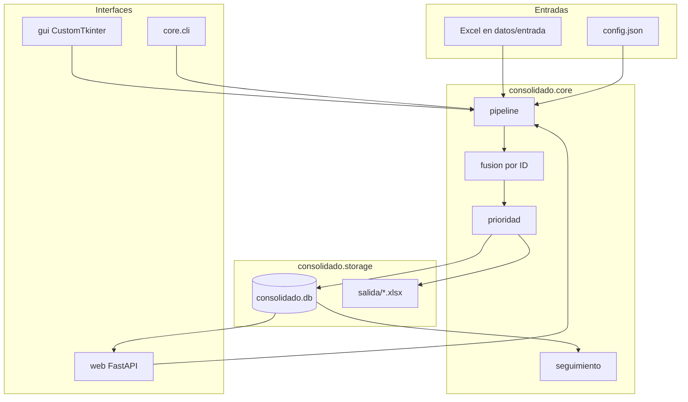

# Manual técnico — Consolidado de Humanidades

Documento para quien mantiene o extiende la aplicación. Complementa el `README.md` (arranque rápido) con arquitectura, pipeline, reglas de negocio, persistencia e interfaz.

**Versión del esquema SQL:** 9 (`SCHEMA_VERSION` en `consolidado/storage/db.py`).
**Interfaz principal:** web FastAPI en `http://127.0.0.1:8765/`.

---

## 1. Propósito

La aplicación fusiona varios libros Excel de estudiantes (matriculados, becas, priorizados, alertas, repetidas, permanencia/ruta de grado y horarios) en un **consolidado por identificación**. Calcula un puntaje de prioridad, guarda un **corte versionado** en SQLite y sirve fichas, seguimiento, metas y gráficas.

No hay un maestro único de estudiante: cada generación es un snapshot `(identificacion, version_id)`. Las marcas globales (priorizado propio, alerta propia, contactado, descartes de alerta) sí viven fuera de la versión.

---

## 2. Stack y requisitos

| Capa | Tecnología |
|------|------------|
| Lenguaje | Python 3.11+ (probado 3.12 / 3.13) |
| Tablas en memoria | Polars |
| Excel | fastexcel (lectura), openpyxl (escritura y hojas complejas) |
| Web | FastAPI + Jinja2 + CSS estático |
| Servidor | Uvicorn (`127.0.0.1:8765`) |
| Sesión | Starlette `SessionMiddleware`, cookie `humanidades_sesion`, 12 h |
| BD | SQLite `datos/consolidado.db` |
| GUI legado | CustomTkinter (`python main.py --gui`) |
| Empaque Windows | PyInstaller (`build_exe.bat` → `dist/ConsolidadoHumanidades/`) |

Dependencias: `requirements.txt`. El `.exe` no requiere Python en el equipo destino; hay que copiar la carpeta completa (`_internal` incluida). Los binarios grandes van con Git LFS.

---

## 3. Arquitectura



**Raíz de datos vs recursos empaquetados** (`consolidado/paths.py`):

- `PROJECT_ROOT`: en desarrollo, la carpeta del repo; en `.exe`, la carpeta del ejecutable (ahí viven `config.json`, `datos/` y `salida/`).
- `BUNDLE_DIR`: en `.exe` es `sys._MEIPASS` (plantillas y CSS embebidos).

---

## 4. Mapa del código

```
main.py                      Entrada: web / --gui / CLI
consolidado/
  paths.py                   PROJECT_ROOT y BUNDLE_DIR
  config/settings.py         Defaults, aliases, fusión con JSON
  core/
    pipeline.py              Orquesta generar consolidado
    archivos.py              Lee cada libro (hoja + HORARIO)
    excel_io.py              Lectura con reintentos si el Excel está abierto
    columnas.py              Encabezados Excel → columnas de salida
    fusion.py                Une filas por identificación
    permanencia.py           Ruta de grado, metas, Activos/graduado
    prioridad.py             Pesos, nivel y color de fila Excel
    seguimiento.py           Listas web (nivel ≥ 1 y activos)
    alertas.py               Alertas de las bases fuente
    priorizado_enriquecido.py Adaptación y activación de ruta
    repetidas.py             Materias repetidas / EST_MATRICULA
    ficha_estudiante.py      Vista de ficha
    colores_programa.py      Acento CSS por carrera
    export.py                Excel de salida (estilos)
    charts.py                Gráficas y export Power BI
    cli.py                   python main.py --entrada …
  storage/
    db.py                    Schema, versiones, filas
    usuarios.py              Login PBKDF2, roles admin/consulta
    periodos.py              Backfill Periodo actual
    contactados.py           Check de Seguimiento
    priorizados.py           Priorizado propio (global)
    alertas_propias.py       Alerta propia (global)
    alertas_fuente.py        Descartes persistentes de alerta
    modificaciones.py        Bitácora (Historial)
    versiones.py             Semilla e importar Excel como versión
  web/
    app.py                   Rutas y middleware de roles
    services.py              Inventario de archivos y generar
    templates/  static/
  gui/                       Escritorio legado
```

Punto de entrada (`main.py`):

| Comando | Efecto |
|---------|--------|
| `python main.py` / `--web` | Uvicorn + recarga; abre el navegador |
| `python main.py --gui` | CustomTkinter |
| `python main.py --entrada <carpeta>` | CLI: lee los `.xlsx` de esa carpeta |
| `.exe` | Igual que la web, **sin** `reload` (pasa el objeto `app`) |

En el `.exe`, `freeze_support()` evita fallos de multiprocessing del bootloader.

---

## 5. Flujo de generación

Función: `generar_dataframe_consolidado` → `ejecutar_consolidado` (`core/pipeline.py`).

1. Recorre `archivos_fuente` de `config.json` y toma los archivos presentes en `datos/entrada/` (o `datos/historico/` si es Datos antiguos).
2. Tipos **auxiliares** no entran al `concat` inicial; se aplican después: `bd_rep`, `bd_alertas_*`, `bd_prio_*`, `bd_permanencia`.
3. `bd2` (grupos priorizados) no crea filas nuevas: solo enriquece IDs ya existentes.
4. `preparar_archivo` lee listado + hoja `HORARIO` (solo `bd1` / `bd12` si existe).
5. `fusionar_por_id` une por identificación normalizada.
6. Documentos adicionales, permanencia/ruta, limpieza de becas de programas no permitidos.
7. Priorizado enriquecido, alertas fuente, descartes SQL, alertas propias, priorizados propios, repetidas.
8. `aplicar_prioridad`.
9. Se escribe Excel versionado y se inserta una **nueva** fila en `versiones` (nunca se pisa un corte previo).

Si el Excel destino del día ya existe, se añade sufijo de hora (`HHMMSS`).

**Datos antiguos:** `carpeta_fuentes=datos/historico/` y `persistir_config=False` para no pisar la config viva ni mezclar con `entrada/`.

---

## 6. Fuentes Excel

Definidas en `config.json` → `archivos_fuente`. Requeridos para generar: `bd1`, `bd12`, `bd2`, `bd3` (`ARCHIVOS_FUENTE_REQUERIDOS`). Permanencia y alertas finales son opcionales.

| Id / tipo | Uso | Hoja típica |
|-----------|-----|-------------|
| `bd1` | Matriculados activos (programas distintos de entrenamiento) | `BASE` + `HORARIO` |
| `bd12` | Matriculados entrenamiento | hoja *Exportar…* (+ `HORARIO` si existe) |
| `bd2` | Grupos priorizados | `GRUPOS_PRIORIZADOS` |
| `bd_prio_psi` | Priorizado Psicología enriquecido | `PRIORIZADOS GENERAL` |
| `bd_prio_lic` | Priorizados Lic. / Comun. / Entrenamiento | `GRUPOS_PRIORIZADOS` |
| `bd3` | Becas y créditos | `BECAS Y CRÉDITOS` (config); fallback `ESTUDIANTES` |
| `bd_rep` | Asignaturas repetidas | `Hoja1` |
| `bd_permanencia` | Ruta de grado y metas | cohortes + base general; metas en hojas aparte |
| `bd_alertas_com` / `bd_alertas_psi` | Alertas por fase `inicial` / `final` | `Sheet` |

La hoja se puede fijar con `"hoja"` en el slot. Si el tipo no viene en config, `_tipo_libro_desde_nombre` lo infiere del nombre del archivo.

`bd1`/`bd3` filtran a **programas permitidos** al leer. `bd12` no se filtra así (el listado ya es de entrenamiento). Las hojas `SQL` y `PIVOT` se ignoran como datos.

Fechas de nacimiento: `bd12` se interpreta MDY; el resto DMY (`_orden_fecha_por_tipo_libro`).

---

## 7. Identificación, fusión y programas

**Clave:** `normalizar_id` quita espacios y decimales típicos de Excel.

**Fusión** (`fusion.py`):

- Nombre: un solo valor (el más largo entre equivalentes).
- Programa: variantes con/sin tilde se unifican (se prefiere la forma con tildes y un programa permitido). Concatenar `A \| B` rompía el filtro de becas.
- Contacto: prioriza `bd1`, luego `bd3`; si falta, combina el resto (incluye `bd12`).
- Teléfonos: se normalizan y se combinan.
- Periodo actual: el más reciente (`periodo_mas_reciente`), no se concatena.
- Total beca: suma de montos; funcionario de beca se combina con regla propia.
- Horario: left join por ID; no crea estudiantes nuevos.
- Filtros finales: programa no excluido, teléfono presente, nombre válido; deduplica por nombre.

**Programas** (`config.json`):

- `programas_permitidos`: Comunicación, Psicología, Licenciatura, Técnico profesional en entrenamiento deportivo.
- `programas_excluidos`: p. ej. Psicología Villavicencio (coincidencia por texto normalizado).
- `programa_es_permitido` acepta varias partes separadas por `\|`.

Tras fusionar, `_limpiar_becas_programa_no_permitido` borra tipo/total/funcionario de beca si el programa de la fila no está permitido.

**Periodos (no mezclar):**

| Concepto | Origen | Ejemplo |
|----------|--------|---------|
| Periodo de la **versión** | Fecha del corte: ene–jun → `YYYY-1`, jul–dic → `YYYY-2` | `2026-2` |
| **Periodo actual** del alumno | `COD_PERIODO` / `COD_PENSUM` (5 dígitos) | `20261` → `2026-1` |

El horario de la ficha usa el periodo actual del alumno.

**Activos / graduados:** si en permanencia la observación de seguimiento contiene «graduado», `Activos=False`, puntaje 0 y detalle «Graduado». No entran a Seguimiento.

---

## 8. Puntaje de prioridad

Única fuente de pesos: `consolidado/core/prioridad.py`.

```
Puntaje = Beca + Priorizado + Repitiendo + Reintegro + Propio + Activación + Ruta
```

| Componente | Regla | Máx. |
|------------|--------|------|
| Beca | Total &lt; 1 M → 1; &lt; 5 M → 2; ≥ 5 M → 3. Se **divide a la mitad** si el responsable es 0, NO o Call Center | 3 |
| Priorizado | Discapacidad +3; cada otro grupo +1; ajuste razonable +2; recomendación +1 | suma |
| Repitiendo | 5 o más → 1; 1–2 → 2; 3–4 → 3 | 3 |
| Reintegro | 1 → 1; 2 o más → 3 | 3 |
| Propio | Marca de priorizado propio | 3 |
| Activación | Activación de ruta = Sí | 20 |
| Ruta | Créditos &gt;90 % → 1; &gt;70 % → 0,5. Opción de grado / inglés: Finalizado 1, Matriculado 0,5. Saber Pro: Finalizado 1, Pagado 0,5 | 4 |

**Nivel** (`_nivel_desde_puntaje`):

| Nivel | Nombre | Condición |
|-------|--------|-----------|
| 5 | Crítico | Activación (20 pts) |
| 4 | Muy alto | Puntaje ≥ 10 |
| 3 | Alto | ≥ 7 |
| 2 | Medio | ≥ 4 |
| 1 | Bajo | ≥ 1 |
| 0 | Sin señal | 0 (un 0,5 de ruta **no** entra a Seguimiento) |

**Color de fila en Excel:** el componente con mayor puntaje pinta la fila (rojo activación, morado priorizado/propio, naranja beca, azules reintegro/repitiendo, esmeralda ruta, amarillo/verde empates, gris si solo queda beca diluida). Hex en `config.json` → `colores_prioridad`.

**Color de acento en la web** (no es el del Excel): `colores_programa.py` — Psicología `#7A1212`, Comunicación `#1B3A8C`, Licenciatura `#4B5320`, Entrenamiento `#B3942E`.

---

## 9. Seguimiento

`listar_seguimiento`: última versión SQL, estudiantes **activos** y **nivel ≥ 1**.

Pestañas (`CATEGORIAS_SEGUIMIENTO`): General (puntaje total), Beca, Priorizado, Repitiendo, Reintegro, Propio, Activación, Ruta, Alertas. En pestañas de componente se muestra ese puntaje, no el total; Alertas muestra recuento.

El check «contactado» es **global** (`priorizados_contactados`), no por versión.

---

## 10. Persistencia SQLite

Archivo: `datos/consolidado.db`. `inicializar_db` crea tablas y migra hasta `SCHEMA_VERSION`. Si cambia el esquema: **incrementar la constante y añadir la migración** en `inicializar_db`.

### Por versión (se borran en cascada con `versiones`)

| Tabla | Contenido |
|-------|-----------|
| `versiones` | Periodo, fecha, conteos, `columnas_json`, ruta Excel, notas |
| `estudiantes_base` | Identidad, contactos, periodos, puntaje, `fila_json` |
| `estudiantes_priorizado` | Priorizado, adaptación, activación |
| `estudiantes_rendimiento` | Beca, funcionario, repitiendo |
| `estudiantes_alertas` | Alertas de ese corte |

Clave: `(identificacion, version_id)`. `fila_json` reconstruye la ficha; las columnas indexables son atajos de búsqueda.

### Globales (no van por corte)

| Tabla | Uso |
|-------|-----|
| `priorizados_propios` | Marca propia |
| `alertas_propias` | Alerta propia |
| `priorizados_contactados` | Check de Seguimiento |
| `alertas_descartadas` | Tipos de alerta fuente quitados a mano |
| `usuarios` | Login |
| `modificaciones` | Historial de acciones |
| `schema_meta` | Versión de esquema |

Claves de usuario: PBKDF2-HMAC-SHA256, 200 000 iteraciones, sal por usuario (`usuarios.hash_clave`). Nunca en texto plano. Si la tabla está vacía se crea `admin` / `admin`.

---

## 11. Interfaz web

`consolidado/web/app.py`. Plantillas en `web/templates/`, estilos en `web/static/app.css`.

Middleware: si no hay sesión → login (API: 401). Rutas admin sin rol admin → inicio con error.

**Rol `consulta`:** Inicio, Estudiante, Seguimiento, Metas, Gráficas, Colores, Versiones (listar y descargar Excel).

**Rol `admin`:** lo anterior más Data (`/archivos`, upload, `/generar`), Configuración, Usuarios, Datos antiguos, Historial, importar/generar versión.

Prefijos solo admin: `/config`, `/usuarios`, `/archivos`, `/upload`, `/datos-antiguos`, `/modificaciones`, `/generar`, más `/versiones/importar` y `/versiones/generar`.

Rutas útiles:

| Ruta | Función |
|------|---------|
| `/` | Inicio (resumen + metas) |
| `/estudiante/{id}` | Ficha |
| `/seguimiento` | Listas por categoría |
| `/versiones/ultima/excel` | Descargar último Excel |
| `/versiones/generar` | Admin: nuevo corte |
| `/api/buscar` | Autocompletar ficha |
| `/api/grafica` | Datos de gráfica |
| `/api/grafica/powerbi` | Excel para Power BI |

Consultor en Versiones: **Descargar último Excel**. Admin: selector descargar vs generar nuevo.

---

## 12. Configuración

| Archivo | Rol |
|---------|-----|
| `config.json` | Config viva (slots, aliases, programas, colores) |
| `config_fabrica.json` | Restaurar de fábrica (la UI puede preservar interfaz/salida) |
| `consolidado/config/settings.py` | Defaults en código |

Al cargar, `_fusionar_con_default` **añade** claves y columnas nuevas del código al JSON existente (no hace falta reescribir a mano `Periodo actual`, etc.).

**Nueva columna de Excel:** alias en `ALIASES_DEFAULT` / `config.json` y expresión en `columnas.py`.  
**Nueva regla de puntaje:** solo `prioridad.py`.  
**Nueva pantalla:** ruta en `app.py` + plantilla; si es admin, `_PREFIJOS_ADMIN`.  
**Nuevo campo persistente:** `db.py` + `fila_json` y, si aplica, campos indexables.

---

## 13. Ejecutable Windows

```
build_exe.bat
```

Salida: `dist/ConsolidadoHumanidades/`. El spec empaqueta plantillas, estáticos, Polars y FastAPI.

**Distribución a usuarios:** no sirve «Download ZIP» del repositorio: GitHub no incluye objetos Git LFS, el `.exe` queda en ~130 bytes de texto y Windows muestra *No se puede ejecutar esta aplicación en el equipo*. Hay que:

- Publicar `ConsolidadoHumanidades-Windows.zip` en **GitHub Releases**, o
- Clonar con `git lfs pull`.

`Ejecutar.bat` comprueba el tamaño del `.exe` y la carpeta `_internal` antes de lanzar. Tras un `build_exe.bat`, esos archivos se copian desde `empaquetado/`.

`.gitignore` ignora `build/` y datos de estudiantes; **no** ignora `dist/`. Los `.pyd` / `.dll` / `.exe` de `dist/` van por Git LFS (Polars ~185 MB).

---

## 14. Convenciones y límites

- Los `.xlsx` de `datos/entrada/` y la `.db` **no** se versionan (datos personales).
- Identificación es la clave de cruce; un mismo nombre con dos IDs son dos personas; dos IDs con el mismo nombre pueden colapsar en `deduplicar_por_nombre`.
- `bd2` y permanencia **no crean** filas: solo completan IDs que ya salieron de matriculados/becas.
- Un estudiante de `bd12` que no esté en priorizados, alertas o permanencia quedará con esos campos vacíos (el cruce es por documento, no por programa).
- Generar con el Excel fuente abierto: `excel_io` reintenta; en web no abre diálogos Tk (`permitir_seleccionar_otro=False`).
- Host local únicamente; no hay despliegue multiusuario en red ni HTTPS en el diseño actual.

---

## 15. Arranque de desarrollo

```bat
python -m venv .venv
.venv\Scripts\activate
pip install -r requirements.txt
python main.py
```

Usuario inicial: `admin` / `admin`. Cárguelo en **Usuarios** en cuanto exista un entorno real.

Para un corte nuevo: Data → subir libros → Generar (admin). Las consultas leen siempre la **última** versión en SQL.
